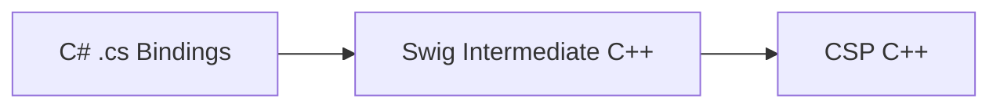

# Implementor Guide

This guide is intended to aid implementors who need to make changes to the SWIG C# wrapper generator, whether that be configuring it to wrap new types, or changing more fundamental behavior.

This guide was initially written early 2026, whilst the wrapper generator was in initial development.

## What is the SWIG C# Wrapper Generator?

[SWIG](https://www.swig.org/) (Simplified Wrapper Interface Generator), is an off the shelf, open source project that generates interop surfaces from C++ -> a large host of languages. At time of writing, it is the most mature and reliable tooling suite in the space.

SWIG has [exhaustive documentation](https://www.swig.org/Doc4.4/index.html), you are encouraged to reference it heavily.

This project wraps the C++ connected spaces platform library to the C# runtime, with a dual focus on exposing expectable C# patterns, and minimizing the implementor effort of wrapping new types. 

### How it works

The magic trick that SWIG does is that it does not wrap directly from C++ -> Target Runtime. It inserts its own intermediate binary, like so.



> [!Note]
> 
> At time of writing, the intermediate binary is named `ConnectedSpacesPlatformDotNet.dll`/`libConnectedSpacesPlatformDotNet.so`, etc.

The intermediate binary links directly against the underlying C++ library as any other normal C++ project would. This is why this project is CMake driven, we are building and linking C++. Our C# API is then generated to work atop it via P/Invoke bindings.

This has a few advantages, but the one that concerns us today is that, by doing this, SWIG allows us to insert adaptation, conversion, and translation code into either the C++ or the C# layer freely. We will see how this is done later in the [wrapping](#Wrapping) section. This setup allows us a fair amount of power when it comes to expressing the C# client usage patterns that we desire.

### Proxy Classes

This magic is expressed by SWIG is in its management of proxy classes, connecting a C++ object to a C# proxy object (even with callbacks if directors are enabled), and maintaining this object to object connection over a P/Invoke interface, (which is all static methods, no objects here).

An example call hierarchy might be:

```
(cs)LogSystem::SetSystemLevel
(cs)ConnectedSpacesPlatformDotNetPINVOKE.csp_common_LogSystem_SetSystemLevel
(cpp)CSharp_csp_common_LogSystem_SetSystemLevel
(cpp)csp::common::LogSystem::SetSystemLevel
```

For a bit more illumination, the generated C++ (or C really) right before CSP is called at the bottom of the stack there, looks like this:

```cpp
SWIGEXPORT void SWIGSTDCALL CSharp_csp_common_LogSystem_SetSystemLevel(void * jarg1, int jarg2) {
  csp::common::LogSystem *arg1 = 0 ;
  csp::common::LogLevel arg2 ;
  
  arg1 = (csp::common::LogSystem *)jarg1; 
  arg2 = (csp::common::LogLevel)jarg2; 
  (arg1)->SetSystemLevel(arg2);
}
```

> [!Note]
> 
> This is also where most typemapping manifests, it's the most important layer. The generated cpp source is not in the final install, having already been built into the binary, so you'll need to get used to finding it in the `build/generated/cpp` directory when debugging.

All of this is without the complexity of callbacks. When directors are involved, we go all the way back up into C# again.

You can see how SWIG is mostly about correctly generating those two intermediate layers in the cs and the cpp, thus creating a connection between C++ and C# objects.

Once we get into the P/Invoke layer, SWIG starts additionally injecting a pointer (`swigCPtr`) as a way of identifying the specific object across the language boundary. Each csharp proxy object is, in essence, just a wrapper around a single `swigCPtr`, using it to call underlying C++ functionality.

In the example above, `jarg1` is always `swigCPtr`, which is passed down from the proxy object in the C#.

### Unity

When this project was conceived, it was to serve the Oko-Unity team. This remains the primary intent. However,  Unity is primarily a C# technology, and Unity specific adaptations are comparatively minor.

For this reason, this library is expressed as a general purpose C#/DotNet library, as it is only a little extra effort to maintain this separation and grant us more flexibility in the future.               

Unity specific adaptations can be enabled by providing the `ENABLE_UNITY_EXTENSIONS` build flag. See the project [README](../README.md) for more information.

## Wrapping

### The Interface File

The core file type that defines the exposed API surface is the *interface file* (.i). If you're looking for somewhere to start, [main.i](../interface/main.i) is your entry point.

Interface files are declarative, yet mirror C/C++ syntax almost 1:1. This is such that you may reuse already existing C++ header files from the base library as your interface specification documents, avoiding the need to re-declare every single public function and type you wish to expose.

As an example of this, observe the following interface file.

```cpp
// Interface/CSP/Common/ReplicatedValue.i

%{
#include "CSP/Common/ReplicatedValue.h"
%}

%include "CSP/Common/ReplicatedValue.h"
```

Most interface files will look like this. The file being included is a CSP public header file. 

You may be surprised to see two different sort of includes. This comes back to wanting to use the existing C++ header as a SWIG interface declaration. 

Any code between `%{ /%}` blocks is copied *verbatim* into the SWIG intermediate C++ library. We must include the type we are planning to expose for the project to build, thus this include is neccesary.

The other include, the `%include` is a simple include that takes the contents of the provided file and puts it directly into this file via the SWIG preprocessor. (The SWIG preprocessor is very similar to the C preprocessor, only it has some expanded capabilities).

This `%include` is our *SWIG Interface Declaration*. SWIG's interface language is just C++ declarations, therefore we can just use the pre-existing file.

> [!Note]
> 
> Generally, % is the token SWIG uses to denote its own functions and macros.

We don't need to do it this way. A completely valid alternate formulation of this would be the following. As far as SWIG is concerned, these are identical.

```cpp
// Interface/CSP/Common/ReplicatedValue.i

// Put necessary include verbatim into C++ intermediate lib
%{
#include "CSP/Common/ReplicatedValue.h"
%}

// Declare SWIG interface
namespace csp
{
    namespace common
    {
        class ReplicatedValue
        {
            ReplicatedValue();
            ReplicatedValue(const ReplicatedValue&);
            //... the rest of the public API
        }
    }
}
```

### Macros

To work with SWIG you are going to have to become comfortable with macros, as unfortunate at that is.

SWIG has its own preprocessor that is somewhat more flexible than the C preprocessor, although it supports all the same `#` directives as the C preprocessor. 

Macros are the tools we use to further avoid having to write reams and reams of repetitive implementation. Whilst it can still get repetitive, at least the repetition is normally one macro invocation, rather than 50 lines of implementation per type.

The relevant place to look for these things is in `Interface/SwigUtils`.

Our macros tend to be declared in all uppercase, and follow a declarative `MAKE_X` sort of form, for example `MAKE_VALUE_EQUATABLE(MyType)`.

> [!Note]
> 
> This project follows a declarative list philosophy. This means that when given the choice to declare features such as the above separately in each relevant interface file, or listed all together in a single file, we favour declaring them all together in a file specifically for that purpose. This intentionally discourages out-of-pattern behavioral configuration on a type-by-type basis.

### Templates

Templates are C++'s generic mechanism, they look like C# generics, using angle brackets like so `std::vector<Type>;`

The comparison ends here though, it's not overly helpful to think of these as the same thing.

The most important thing to understand is that C++ templates are *[monomorphic](https://en.wikipedia.org/wiki/Monomorphization)*. This means that whilst they may look generic, they are transformed at compile time into unique, fully specialized versions of the type for each template instantiation that happens to exist.

This means that, if you have:

```cpp
template <typename T>
class MyTemplateClass<T>
{
    ...
}

// Somewhere else
MyTemplateClass<int> a;
MyTemplateClass<string> b;
```

`MyTemplateClass<T>` *does not exist* in the compiled binary.
What is actually placed into the binary will look something more like :
```
_Z16MyTemplateClassIiE      // MyTemplateClass<int>
_Z16MyTemplateClassISsE     // MyTemplateClass<std::string>
```

The specifics of the mangling depends on the compiler toolchain, but the important thing is that these are unique, concrete types. Templates are an illusion and cannot exist in C++ binaries. C++ has no generics!

This is in contrast to C#, which among many other differences, handles generics via JIT compilation, meaning C# libraries can distribute generic types. Lucky them.

#### Explicit Instantiation

Keen eyed readers might have a question here. How does the C++ compiler know which types to generate, does it need to generate every possible type combination?

The answer is that the C++ compiler generates whatever types happen to be used, which is rather crude, but 100% effective if you are working in a single binary.

The complexity comes when you are exporting functions and types for use in other binaries. Suddenly there are functions and types that as far as the C++ compiler is concerned, are never invoked. The C++ compiler has no knowledge of which functions a consuming program may call in the future! This means the compiler does not generate the concrete types for any generics involved in those functions. Oh no!

This is a common footgun with C++ library development, but luckily there is an equally common solution, known as _explicit instantiation_. This is a fancy way of saying that we'll just use them somewhere, declare the instantiations we need somewhere in a source file just to force the compiler to generate the types. At time of writing, CSP has a central location for this [here](https://github.com/magnopus-opensource/connected-spaces-platform/blob/main/Library/src/ExplicitTypes.cpp).

#### Handling this in SWIG

For these reasons, when binding to C++ types, there is no option but to give each instantiation a unique, concrete name, you cannot bind directly to generics as you might expect. Another fundamental incompatibility.

SWIG provides a helpful directive for this, it looks like:

```
%template(StringList) csp::common::List<csp::common::String>;
```

This is effectively a fancy rename. SWIG understands how to find the mangled symbol from the binary. This directive tells SWIG to do that, and assign it a specific name. After you have used this directive, you can refer to `StringList` in other SWIG directives as you would any other type, although `csp::common::List<csp::common::String>` will work too, as SWIG maintains an understanding of this due to being a C++ binary itself.

> [!Note]
> 
> Whilst this may seem annoying in the case of containers, C# devs do not need to interact with these concretions if they do not wish to. All containers in the wrapper implement *at least* `IEnumerable<T>`, allowing you to write your C# against more abstract interfaces. See the [containers](#containers) section for more on this.

There's a lot of complexities here. If you find yourself struggling with binding template types, think :
- Do I believe CSP has exported this type? You can check this manually by inspecting the binary with common tools. Ask an LLM.
- Have I bound the exported type to a real name via `%template`?

> [!Tip]
> 
> Did you know! C++98 standardized the `export` keyword in an attempt to resolve these complexities. However, exporting templates is such a tricky problem only one compiler (EDG's Comeau C++) ever managed successfully implement it. They keyword was voted out in C++11 and remained reserved until repurposed for usage in modules during C++20 standardization.

### C#'s Split Type System

C++ and C# have another fundamental incompatibility, being that C++ uses uniform value semantics, whereas C# has a split type system.

Said simply, this means that in C#, the value behavior of a type is something you decide on for yourself, depending on whether you declare the type as a `class` or a `struct`.

This is not the case in C++, all types are copied in all interfaces no matter what. The way it achieves this whilst remaining performant is via the ever present pointer. Consider the following C++.

```cpp
void Function1(Type a);
void Function2(Type* a);
```

In both of these cases, `a` is copied. The difference being that Function2 is copying a _pointer_, (just a 64 bit `uint` on most platforms), _not_ an entire `Type`.

This is an essential concept, and it is why every type in the SWIG C# interface is declared as `class` rather than mixing `struct` into the mix when it seems appropriate, such that we can map uniformly onto C++. We achieve value equality in [other ways](#equatability) where appropriate.

A particularly gnarly place this pops us is in containers. Consider how to represent the following distinction in C#.

```cpp
std::vector<Type> a;
std::vector<Type*> a;
```

How this project chooses to solve this is by declaring two different types of list, a `TypeValueList` and a `TypePointerList`, which solves the problem, albeit in a bit of an unexpected way to the C# developer. Another option would be to enforce strict C#-like value categories in CSP types themselves, which would work for us, but introduce other incompatibilities in other language runtimes that CSP wishes to bind to.

 This sort of thing is unavoidable, fundamental incompatibilities will always introduce a little strangeness, no matter how much we try to minimize it.

> [!Note]
> 
> I wouldn't be surprised if this, especially the naming conventions of the containers, changes as we finish wrapping the API. This doc is being written before then. The only things in CSP that really need this distinction currently are SpaceEntities in the multiplayer module, most everything else is simple.

### Features

This section is concerned with the custom features built into this wrapper generator to place desirable patterns in the C# API. 

When we say feature here, we mean things like async/await, equatability, etc, ie features of *types*. We do *not* mean features in the sense that CSP has the "feature" of allowing you to enter a space.

#### Optional

Optional types are represented in C++ as `Optional<T>`. As this is a first class language feature in C# (`T?`), this transformation is applied.

You may use the declaration `%optional` to declare that any given type may be expressed as optional interfaces, and enable type-mapping of any signatures that contain it.

Example : `%optional(csp::common::Array<csp::FeatureFlag>)` 

This optional array is used in `Initialize`, and enabling the typemap with the above declaration causes SWIG, upon encountering this signature, to generate  an interface that looks like the following: 

```csharp
public static bool Initialise(string EndpointRootURI, string Tenant, csp.ClientUserAgent ClientUserAgentHeader, csp.common.FeatureFlagValueArray? FeatureFlagOverrides) {
```

See [OptionalDeclarations.i](../interface/swigutils/OptionalDeclarations.i) for more.


#### Equatability

As C# is a reference semantic language, comparisons between objects declared as `class` have the following behavior :

```csharp
MyClass x = new MyClass(1,2);
MyClass y = new MyClass(1,2);
bool isSameClass = x == y;
// isSameClass = false

MyStruct x = new MyStruct(1,2);
MyStruct y = new MyStruct(1,2);
bool isSameStruct = x == y;
// isSameStruct = true
```

This is somewhat sticky when you consider that C++ does not share C#'s split type system, and is extra complicated when you consider it is common in C++ to provide custom equality operators. 

The solution chosen for this project is to lean on [IEquatable](https://learn.microsoft.com/en-us/dotnet/api/system.iequatable-1?view=net-10.0).

Any type that is deemed to be a "value type" should declare `MAKE_VALUE_EQUATABLE`, an example being `MAKE_VALUE_EQUATABLE(csp::common::Vector2)`. This causes the `IEquatable` interface implementation to be generated on that type, leading to performant, non-boxed equality whilst not requiring CSP to maintain unidiomatic strict value categories on a per-type basis.

> [!Note]
> 
> Implementing `IEquatable` requires specific implementation of the equality and hash operators at the CSP level. It will not work out of the box for most types. Kick CSP and make them add these operators for you if you need them, or do it yourself!

See [Equatable.i](../interface/swigutils/Equatable.i) for more.

#### Containers

Containers rely heavily on typemapping, see [interface/swigutils/typemaps](../interface/swigutils/typemaps/).

All containers are template types, and thus must be declared as described [above](#templates). See [interface/swigutils/TemplateDeclarations.i](../interface/swigutils/TemplateDeclarations.i)

The relevant containers at time of writing are `Array`, `List`, and `Map`.

These container typemaps implement DotNet interfaces in order to conform to standard behaviour expectations. At time of writing, that is as follows: 

- `Array` implements [IReadOnlyList](https://learn.microsoft.com/en-us/dotnet/api/system.collections.generic.ireadonlylist-1?view=net-10.0)
- `Map` implements [IDictionary](https://learn.microsoft.com/en-us/dotnet/api/system.collections.generic.idictionary-2?view=net-10.0)
- `List` implements at minimum [IEnumerable](https://learn.microsoft.com/en-us/dotnet/api/system.collections.generic.ienumerable-1?view=net-10.0), but will implement [IList](https://learn.microsoft.com/en-us/dotnet/api/system.collections.ilist?view=net-10.0) in the case that the contained type provides the equality operator, which is necessary. See the bottom of [Csp_List.i](../interface/swigutils/typemaps/Csp_List.i) for the declarations on this.

Containers are exposed in the C# interfaces via their concrete name (the name declared in the `%template` declaration). You may work with them as their interfaces however, which some C# devs may find more natural.

Containers are not equatable, they retain reference semantics even if the types contained within them *are* equatable. Whilst this does simplify implementation, the actual reason we chose to do this was that C# developers felt, after consultation, that this is a more expectable behavior.

#### Async

By far the most intricate part of this binding. CSP is a heavily async library, and performing async tasks across an API boundary is challenging.

SWIG does some work to simplify this by its [director](https://www.swig.org/Doc4.4/CSharp.html#CSharp_directors) system, which is how we elect to manage async in this project.

This is as close as we get to "SWIG Magic", as SWIG does a heck of a lot to manage the link between underlying object, director trampoline, and frontend proxy class in such a way that you can naturally call C# code from C++.

What we need to be concerned about is mapping this rather low level `virtual` based system to a system that works naturally for C# developers. This means transforming a `virtual` callback into something that can be used like a delegate, as well as something that can be used naturally in `await` style programming.

##### Callbacks

We'll start with callbacks, as this is the foundation for `await`. The relevant file is [interface/swigutils/CallbackAdapters](../interface/swigutils/CallbackAdapters.i).

You'll have to look inside the file for the specifics. Conceptually, what we do first is make a callback adapter object that we can inherit from, and pass to CSP, like so.

```Csharp
class MyTypeCallbackAdapter
{
public:
    virtual ~MyTypeCallbackAdapter() = default;
    virtual ReturnType Call(ArgT arg1, ArgT arg2) = 0;
};
```

**This is the director**. You'll see this class is declared as `%feature("director") CALLBACK_ADAPTER_NAME;`.

Further on in the file, we do the most complex typemapping in the project. The secret sauce is the following shim, which causes the lambda to get inserted into all C++ code that triggers this typemap.

```cpp
%typemap(in) CALLBACK_CPP_SYMBOL {
  $1 = [$input](ARG_LIST_WITH_TYPES) {
    return $input->Call(ARG_LIST_WITHOUT_TYPES);
  };
}
```

Don't worry about the specific syntax, notice the `$input` capture. This is our director object. The lambda is compatible with CSP interfaces which are `std::function` based, so we pass it in as the CSP result callback, and it then goes on to call it's captured director object, which allows us to call back into C#!

Remember that this shim is ultimately being called as the CSP callback, so the type signatures must be identical. This can get confusing especially if you're already playing with the type hierarchy in other SWIG adaptations.

##### Delegates & Await

This is all well and good, we can now call C# from C++, but it's a bit ugly. I don't want to have to inherit from a generated type every time I call an async method, I just want to use a delegate, or call `await Func();`!

That's the next bit, we build upon this. The relevant file here is [interface/swigutils/AsyncAdapters.i](../interface/swigutils/AsyncAdapters.i)

> [!Warning]
> 
> You need to have declared the correct callback adapters to wrap delegate or await semantics, as that is always the underlying mechanism.

This file gives us `MAKE_ACTION_CALLBACK`, which produces something like this in the C#.

```csharp
public sealed class MyTypeActionCallback: MyTypeCallbackAdapter
{
    private readonly System.Action<ArgT, ArgT> CallbackHandler;
    public MyTypeActionCallback(System.Action<ArgT, ArgT> handler) => CallbackHandler = handler;
    public override void Call(ArgT arg1, ArgT arg2) => CallbackHandler(arg1, arg2);
}
```

This doesn't bear overly much explaining. It is a small wrapper which receives the overridden callback via inheritance, allowing you to inject a `System.Action` and react to that in an async manner.

This means your user facing C# code can now be something like this, using the LogSystem as an example. Here we have named what above is `MyTypeActionCallback` as `LogCallback` :

```csharp
ConnectedSpacesPlatformDotNet.LogCallback callback = new ConnectedSpacesPlatformDotNet.LogCallback((logLevel, message) =>
{
    capturedLevel = logLevel;
    capturedMessage = message;
});

logSystem.SetLogCallback(callback);
```
You don't normally need to call `MAKE_ACTION_CALLBACK` manually, as getting `await` support depends on it, and the upcoming `MAKE_ASYNC` macro calls it for you.

> [!Note]
> 
> These are separate because not all async interfaces are awaitable. Think of the LogSystem, you don't `await` calls to that, but they still cause your registered callback to fire async, so we still need the ability to bind only the callback/action form.

Speaking of `MAKE_ASYNC`, it's the last piece of the puzzle.

I won't paste in the type here, as it does essentially the same thing as the callback adapter above, taking one async mechanism, the `System.Action` we defined above, and transforming it to another. In this case, it is a `Task` and `TaskCompletionSource`, which allows `await`.

The compromise we have here is that we are declaring brand new wrapper methods, so they need different names. Currently, we just append `Async` to awaitable methods that return `Task<T>`. This is the only compromise as far as C# semantics are concerned, and async methods imbued with `MAKE_ASYNC` are able to be called thusly,
`var Result = await MySystem.MyMethodAsync(args)`, without having to worry about providing or managing callbacks at all.

## Build System

The build system is Cmake, refer to [CMakeLists.txt](../CMakeLists.txt) as your entry point.

To invoke the full build as normal, running the configure, build and install phases, enter into your terminal:

```powershell
rmdir build -r; rmdir install -r; cmake -S . -B build; cmake --build build --config Debug; cmake --install build --config Debug
```

By default, the project will download the latest CSP release from github each time you build. If you wish to use a specific, local version of CSP, you can do that via doing `-B build -DCSP_ROOT_DIR="C:/path/to/CSPRelease` in the build command. `CSPRelease` should be a folder packaged in the same format as the downloaded CSP release from github, ie it contains `include`, `lib`, etc.

Build artifacts, including the downloaded CSP, can be found in the ephemeral build directory. (`build` if using the above command) Two subfolders are particularly relevant.

- `_deps`. This is where build dependencies are placed. Notably, CSP gets downloaded/extracted into this folder. The [custom SWIG version](#custom-swig) we use is also downloaded and placed here.
- `generated`. This is where the generated C++/C# output is placed prior to install. You may need to look at this whilst debugging.

## Tests

### XUnit Tests

The primary test suite. Tests the generated C# interfaces in an XUnit harness. Focuses on testing adaptations/systems that have been placed into this wrapper generator project in a unit test like manner.

Importantly, it does not test the entire API surface. We assume that if one type is generated correctly in a certain category, they all are.

This is the place to test fundamental mechanisms such as async, equatability, generics mapping, etc.

This suite does _not_ test any unity extensions, and will not function if you have compiled with `ENABLE_UNITY_EXTENSIONS`, as it does not have access to the `UnityEngine` api. Use the Unity integration suite to test things under that umbrella, even if you're writing unit tests.

To run this suite, after having built and installed the project, navigate to `InteropTestsXUnit` and open the .`csproj`. The test project knows to look in the standard `install` location, so if you have installed the generated lib there, you should just be able to hit play. 

### Unity Integration Tests

This test suite is a Unity project, and runs inside the Unity editor. It's intent is twofold:

- To serve as a broader integration suite with real workflows tested to reinforce confidence
- To test Unity adaptations which can only be tested with access to the `UnityEngine` types.

It does not test the entire API surface, as CSP has those tests itself, and there is no need to repeatedly test rote transformations.

This test suite can be found [here](../UnityProject/CspUnityTests)

> [!Warning]
> 
> The Unity integration tests do not currently run on CI, due to some internal friction around getting access to license files/domains of responsibility. It's important that this gets dealt with sooner rather than later.
>
> If this remains unresolved, I expect the XUnit test suite will begin to take on more responsibility than it really should, simply out of convenience pressure.

### CI
The project runs the build and test suite via github actions every time a PR is made. We run as full a platform matrix as we can, but at time of writing this is limited to desktop platforms, as running test suites on mobile devices is tricky. We are also limited strictly to the platforms CSP supports. If CSP expands platform support, small work will need to be done to add additional test matrix entries.

Refer to the [actions folder](../.github/workflows) to see a full breakdown, it's pretty self explanatory.

## Footguns

The following is a list of footguns that might blow you away if you're not careful. It's not a clean sort of problem domain, so expect a few.

### Custom SWIG

Be aware that we use a custom version of SWIG, to solve the IL2CPP problem that comes with building for Unity. This is something that many people have solved in various ways, but none have *quite* managed to get pushed back upstream into mainline SWIG yet.

You may find it [here](https://github.com/MAG-ElliotMorris/swig-il2cpp-directors), as well as the entire changeset from upstream [here](https://github.com/MAG-ElliotMorris/swig-il2cpp-directors/commit/9015eb267981e9890442a37ad0c4d64d58d82deb).

It should maintain all expected behavior, except one specific case where callback overloads are likely non supported. See [here](https://github.com/MAG-ElliotMorris/swig-il2cpp-directors/blob/9015eb267981e9890442a37ad0c4d64d58d82deb/Source/Modules/csharp.cxx#L4090). We do not utilize callback overloads currently, and I don't relish trying.

There is a a more discussion of this on the [initial prototype](https://github.com/magnopus-opensource/SwigCSharpProto?tab=readme-ov-file#custom-cut-of-swig)

### CSP Interop Types

CSP has always used what I deem _custom interop types_. These are the things like `CSP::List`, `CSP::Array`, etc. They are blessed types and have special preference in the legacy wrapper gens.

They are also riddled with subtle bugs. A significant goal of this project was to allow us to remove them.

However, we can't do that until all the platforms are capable of removing them, this means we're stuck supporting them for now.

SWIG provides [typemaps](https://github.com/swig/swig/tree/master/Lib/csharp) out of the box for many standard types. The typemaps we use for our custom types are adaptations of these. The ambition is eventually to replace them with the out of the box typemaps.

### Typemaps failing silently

When working with typemaps, don't expect SWIG to tell you if you've got something wrong, it's not the loudest thing in the world. It normally just fails silently.

You can check this quickly by scanning the CSharp output, and seeing if any of the files are named like `SWIGTYPE_p_csp__some__type`. This means that SWIG does not know what to do with this type, and has exposed it as an opaque handle. You don't want any of these types.

This can happen with template types too, if you haven't given them a proper name.

There are quite a lot of options you can enable to make SWIG louder and more verbose, although I haven't experimented too hard with them yet. Notably there is `debug-typemap` which is one I am especially interested in. Call `swig -help` for a full list.

### CSP legacy wrapper gen annotations

In order to support the legacy wrapper generator, CSP has **heavily** annotated its code, and frankly got itself all twisted up in knots.

SWIG parses C++ headers directly, and thus cannot work with these unknown macros. To handle this, we do a few things.

Firstly, we undefine all the macros so SWIG, if it does encounter one, views it as harmless. This occurs in [interface/swigutils/MacroZapper.i](../interface/swigutils/MacroZapper.i)

However, that is not enough as CSP has multiple modes of annotation, including annotations that ignore entire swathes of code as a hacky way to prevent it hitting the legacy wrapper generator. These swathes of code can cause SWIG to be unable to compile at all if left alone, as CSP was not written with the intent of being consumed that way.

To deal with this, we preprocess all of CSP as part of the build step, and remove these chunks wholesale. This is done via calling [Utilities/StripNoExport/StripNoExport.py](../Utilities/StripNoExport/).

If CSP makes a change that is unusual/out of pattern, this is a potential point of breakage. There are no rules here, just patterns.

> [!Warning]
> 
> Some files are ignored in the export stripping, because we need bits of them! These tend to be the things that the legacy wrapper generator had hard-coded support for. You can find the list of ignored files in the python file linked above.

### Ordering can matter

Not much to say on this. It can matter when and where you call SWIG declarations. Normally, what matters is if you're calling a thing before or after you declare the API.

Still, it's confusing, be aware.

### Rebuilds

More annoying than a footgun, rebuilds wont be clean unless you delete your build and install directories beforehand, which you should very much be doing. We can make this better by canonizing a proper clean step.